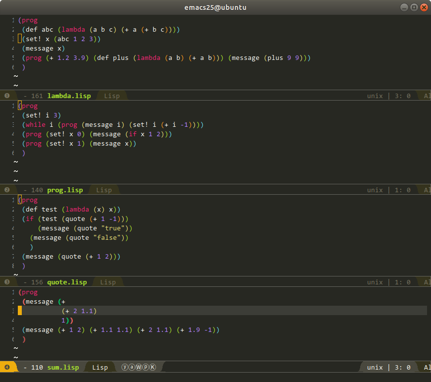

# lispoo

Code Oops Lisp Interpreter

# build

```sh
$ ./build.sh
```

# example



```sh
$ ./lispoo example/lambda.lisp
(6)(18)

$ ./lispoo example/prog.lisp
(3)(2)(1)(2)(1)

$ ./lispoo example/quote.lisp
("false")((+ 1 2))
```